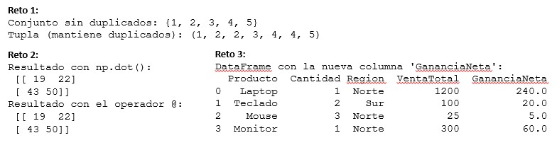
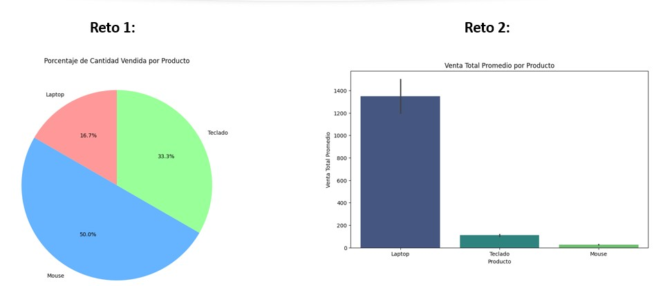

### 🎯 Práctica 1.1: Bases de Python y Librerías Esenciales

### **Objetivos**

  * Familiarizarte con el entorno de **Google Colab**.
  * Repasar las **estructuras de datos básicas de Python**.
  * Comprender y usar la librería **NumPy** para operaciones numéricas eficientes.
  * Utilizar la librería **Pandas** para la manipulación y el análisis de datos.

**Duración aproximada:**
- 60 minutos.

**Tabla de ayuda:**

Para la ejecución del código ingresar a https://colab.research.google.com/ 

### **1. Introducción al Entorno de Trabajo: Google Colab**

**Google Colab** es un entorno de cuadernos de Jupyter que funciona en la nube. Te permite escribir y ejecutar código Python directamente en tu navegador. Una de sus mayores ventajas es que proporciona acceso gratuito a **GPUs**, lo cual es fundamental para el *deep learning*.

#### **Tutorial Básico de Colab**

1.  **Crea un Nuevo Cuaderno**: Ve a [colab.research.google.com](https://colab.research.google.com) y haz clic en `Archivo` \> `Nuevo cuaderno`.
2.  **Celdas de Código y Texto**: Los cuadernos se componen de **celdas de código** (para escribir Python) y **celdas de texto** (para añadir explicaciones en formato Markdown).
3.  **Conexión y GPU**: En la esquina superior derecha, puedes ver el estado de tu conexión. Para activar la GPU, ve a `Entorno de ejecución` \> `Cambiar tipo de entorno de ejecución` y selecciona **GPU**.
4.  **Gestión de Archivos**: Sube y gestiona archivos desde el panel izquierdo (icono de la carpeta 📂).
5.  **Colaboración**: Haz clic en `Compartir` para trabajar en equipo en el mismo cuaderno.

#### **Ejercicio**

¡Ejecuta la siguiente celda de código en Colab\!

```python
print("¡Hola! Bienvenido a tu primera práctica en Google Colab.")
```

-----

### **2. Repaso de Estructuras Básicas en Python**

Antes de sumergirnos en el análisis de datos, es crucial repasar las estructuras básicas de Python que usaremos constantemente.

#### **Variables y Tipos de Datos**

Python maneja varios tipos de datos como **enteros** (`int`), **decimales** (`float`), **cadenas** (`str`) y **booleanos** (`bool`).

```python
# Variables y sus tipos
cantidad = 5          # Entero (int)
precio = 19.99        # Decimal (float)
producto = "Laptop"   # Cadena (string)
en_stock = True       # Booleano (bool)

print(f"La cantidad es de tipo: {type(cantidad)}")

# Conversión de tipos
precio_entero = int(precio)
print(f"El precio como entero es: {precio_entero}")
```

#### **Colecciones de Datos**

| Estructura | Descripción | Mutabilidad | ¿Permite Duplicados? |
| :--- | :--- | :--- | :--- |
| **Listas** | Colección ordenada de elementos. | Mutable | Sí |
| **Tuplas** | Colección ordenada de elementos. | Inmutable | Sí |
| **Diccionarios** | Pares de `clave:valor`. | Mutable | No (las claves) |
| **Conjuntos (Sets)** | Colección no ordenada. | Mutable | No |

```python
# Listas
inventario_lista = ["Laptop", "Teclado", "Mouse", "Laptop"]
print(f"Lista original: {inventario_lista}")
inventario_lista.append("Monitor") # Modificar la lista
print(f"Lista modificada: {inventario_lista}")

# Diccionarios
precios_dicc = {"Laptop": 1200, "Teclado": 100, "Mouse": 25}
precios_dicc["Monitor"] = 300 # Añadir un nuevo par
print(f"Diccionario de precios: {precios_dicc}")

# Conjuntos (Sets)
inventario_set = {"Laptop", "Teclado", "Mouse", "Laptop"}
print(f"Set sin duplicados: {inventario_set}")
```

#### **Reto**

Crea una lista de números con duplicados. Luego, conviértela a un conjunto y a una tupla, y observa la diferencia en la salida.

```python
# Pista: Usa las funciones set() y tuple() para las conversiones
mi_lista = [1, 2, 2, 3, 4, 4, 5]

# Tu código aquí
```

-----

### **3. NumPy: Operaciones Numéricas Eficientes**

**NumPy** (Numerical Python) es la librería fundamental para la computación numérica. Nos permite trabajar con **arrays** multidimensionales de manera muy rápida, lo que es crucial para el *machine learning*.

#### **Ejercicio**

Multiplica cada elemento del `array` por 5 y luego calcula la suma de ambos *arrays*.

```python
import numpy as np

precios = np.array([10, 15, 20, 25])

precios_con_iva = precios * 5
print("Precios con IVA:", precios_con_iva)

precios_con_envio = precios + precios_con_iva
print("Suma de ambos arrays:", precios_con_envio)
```

#### **Reto**

Crea una matriz 2x2 de NumPy y realiza la multiplicación de matrices con otra matriz 2x2.

```python
# Pista: Usa la función np.dot() o el operador @
matriz_a = np.array([[1, 2], [3, 4]])
matriz_b = np.array([[5, 6], [7, 8]])

# Tu código aquí
```

-----

### **4. Pandas: El Poder de los *DataFrames***

**Pandas** es la librería más utilizada para la manipulación y análisis de datos. Su estructura principal, el **DataFrame**, es similar a una hoja de cálculo, lo que facilita el trabajo con datos estructurados.

#### **Ejercicio**

Carga un `DataFrame` con datos incrustados y filtra las ventas de la región "Norte".

```python
import pandas as pd

# Incrustar los datos del archivo CSV directamente en el código
data = {'Producto': ['Laptop', 'Teclado', 'Mouse', 'Monitor'],
        'Cantidad': [1, 2, 3, 1],
        'Region': ['Norte', 'Sur', 'Norte', 'Norte'],
        'VentaTotal': [1200, 100, 25, 300]}

ventas_df = pd.DataFrame(data)
print("DataFrame completo:")
print(ventas_df.head())

ventas_norte = ventas_df[ventas_df['Region'] == 'Norte']
print("\nDataFrame filtrado por la región Norte:")
print(ventas_norte)
```

#### **Reto**

A partir del `ventas_df`, crea una nueva columna llamada `GananciaNeta` que sea el 20% de la `VentaTotal`, y muestra el `DataFrame` actualizado.

```python
# Pista: La sintaxis para crear una nueva columna es df['nombre_columna'] = valor
ventas_df['GananciaNeta'] = ventas_df['VentaTotal'] * 0.20

# Tu código aquí
```
### Resultado esperado


-----

### 📈 Práctica 1.2: Visualización con Matplotlib y Seaborn

### **Objetivos**

  * Comprender la importancia de la visualización de datos.
  * Aprender a crear gráficos básicos con **Matplotlib**.
  * Usar **Seaborn** para crear gráficos más avanzados y estéticos.
  * Analizar los datos de un `DataFrame` a través de la visualización.

**Duración aproximada:**
- 60 minutos.

**Tabla de ayuda:**

Para la ejecución del código ingresar a https://colab.research.google.com/ 

### **1. Introducción a la Visualización de Datos**

La **visualización** es un paso crucial en el análisis de datos. Nos ayuda a entender la distribución, detectar patrones y descubrir relaciones entre variables. Usaremos dos librerías esenciales: **Matplotlib** y **Seaborn**.

-----

### **2. Gráficos Básicos con Matplotlib**

**Matplotlib** es la librería más popular para crear gráficos en Python. Nos permite tener un control total sobre cada elemento del gráfico.

#### **Ejercicio**

Usa un `DataFrame` con datos de ventas para crear un **gráfico de barras** que muestre la venta total por cada producto.

```python
import pandas as pd
import matplotlib.pyplot as plt

# Datos de ventas incrustados
data = {'Producto': ['Laptop', 'Laptop', 'Teclado', 'Teclado', 'Mouse', 'Mouse'],
        'Cantidad': [1, 1, 2, 2, 3, 3],
        'VentaTotal': [1200, 1500, 100, 120, 25, 30]}
ventas_df = pd.DataFrame(data)

# Agrupar las ventas por producto
ventas_por_producto = ventas_df.groupby('Producto')['VentaTotal'].sum()

# Crear el gráfico de barras
plt.figure(figsize=(10, 6))
plt.bar(ventas_por_producto.index, ventas_por_producto.values, color='skyblue')
plt.title('Venta Total por Producto')
plt.xlabel('Producto')
plt.ylabel('Venta Total')
plt.grid(axis='y', linestyle='--')
plt.show()
```

#### **Reto**

Crea un **gráfico de pastel** (*pie chart*) para visualizar el porcentaje de la `cantidad` vendida de cada producto.

```python
# Pista: Usa el método .pie() de matplotlib.pyplot
# Agrupa los datos por 'Producto' y suma la 'Cantidad'
cantidad_por_producto = ventas_df.groupby('Producto')['Cantidad'].sum()

# Tu código aquí
```

-----

### **3. Gráficos Más Atractivos con Seaborn**

**Seaborn** es una librería de alto nivel que simplifica la creación de gráficos estadísticos complejos y estéticos. Es ideal para explorar las relaciones entre variables.

#### **Ejercicio**

Usa el mismo `DataFrame` de ventas para crear un **gráfico de dispersión** que muestre la relación entre la `Cantidad` vendida y la `VentaTotal`.

```python
import seaborn as sns
import matplotlib.pyplot as plt
import pandas as pd

# Datos de ventas incrustados
data = {'Producto': ['Laptop', 'Laptop', 'Teclado', 'Teclado', 'Mouse', 'Mouse'],
        'Cantidad': [1, 1, 2, 2, 3, 3],
        'VentaTotal': [1200, 1500, 100, 120, 25, 30]}
ventas_df = pd.DataFrame(data)

# Crear el gráfico de dispersión con Seaborn
plt.figure(figsize=(10, 6))
sns.scatterplot(x='Cantidad', y='VentaTotal', data=ventas_df, hue='Producto', s=100)
plt.title('Relación entre Cantidad y Venta Total por Producto')
plt.xlabel('Cantidad Vendida')
plt.ylabel('Venta Total')
plt.show()
```

#### **Reto**

Crea un **gráfico de barras** utilizando Seaborn para mostrar la `venta total promedio` por producto.

```python
# Pista: Usa sns.barplot()
# Los datos ya están listos en ventas_df
# Seaborn calculará automáticamente el promedio si se lo indicas

# Tu código aquí
```

### Resultado esperado

