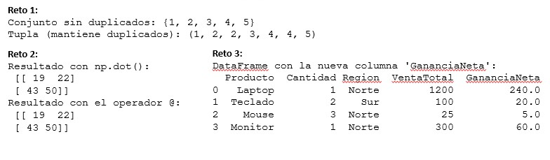

# Práctica 1.1. Bases de Python y librerías esenciales

## Objetivos
Al finalizar la práctica, serás capaz de:
  * Familiarizarte con el entorno de **Google Colab**.
  * Repasar las **estructuras de datos básicas de Python**.
  * Comprender y usar la librería **NumPy** para operaciones numéricas eficientes.
  * Utilizar la librería **Pandas** para la manipulación y el análisis de datos.

**Duración aproximada**
- 60 minutos.

**Tabla de ayuda**

Para la ejecución del código, ingresa a https://colab.research.google.com/ 

## Instrucciones

### Tarea 1. Introducción al entorno de trabajo: Google Colab

**Google Colab** es un entorno de cuadernos de Jupyter que funciona en la nube. Te permite escribir y ejecutar código Python directamente en tu navegador. Una de sus mayores ventajas es que proporciona acceso gratuito a **GPU**, lo cual es fundamental para el *deep learning*.

**Paso 1.** Crea un nuevo cuaderno
Dirígete a [colab.research.google.com](https://colab.research.google.com) y haz clic en `Archivo` \> `Nuevo cuaderno`.
Los cuadernos se componen de **celdas de código** (para escribir Python) y **celdas de texto** (para añadir explicaciones en formato Markdown).

**Paso 2.** En la esquina superior derecha, puedes ver el estado de tu conexión. Para activar la GPU, ve a `Entorno de ejecución` \> `Cambiar tipo de entorno de ejecución` y selecciona **GPU**.

**Paso 3.** Sube y gestiona archivos desde el panel izquierdo (icono de la carpeta 📂).

**Paso 4.** Haz clic en `Compartir` para trabajar en equipo en el mismo cuaderno.

**Paso 5.** Ejecuta la siguiente celda de código en Colab\.

```python
print("¡Hola! Bienvenido a tu primera práctica en Google Colab.")
```

-----

### Tarea 2. Repaso de estructuras básicas en Python

Antes de sumergirte en el análisis de datos, es crucial repasar las estructuras básicas de Python que usarás constantemente.

#### **Variables y tipos de datos**

Python maneja varios tipos de datos como **enteros** (`int`), **decimales** (`float`), **cadenas** (`str`) y **booleanos** (`bool`).

```python
# Variables y sus tipos
cantidad = 5          # Entero (int)
precio = 19.99        # Decimal (float)
producto = "Laptop"   # Cadena (string)
en_stock = True       # Booleano (bool)

print(f"La cantidad es de tipo: {type(cantidad)}")

# Conversión de tipos
precio_entero = int(precio)
print(f"El precio como entero es: {precio_entero}")
```

#### **Colecciones de datos**

| Estructura | Descripción | Mutabilidad | ¿Permite duplicados? |
| :--- | :--- | :--- | :--- |
| **Listas** | Colección ordenada de elementos. | Mutable | Sí |
| **Tuplas** | Colección ordenada de elementos. | Inmutable | Sí |
| **Diccionarios** | Pares de `clave:valor`. | Mutable | No (las claves) |
| **Conjuntos (Sets)** | Colección no ordenada. | Mutable | No |

```python
# Listas
inventario_lista = ["Laptop", "Teclado", "Mouse", "Laptop"]
print(f"Lista original: {inventario_lista}")
inventario_lista.append("Monitor") # Modificar la lista
print(f"Lista modificada: {inventario_lista}")

# Diccionarios
precios_dicc = {"Laptop": 1200, "Teclado": 100, "Mouse": 25}
precios_dicc["Monitor"] = 300 # Añadir un nuevo par
print(f"Diccionario de precios: {precios_dicc}")

# Conjuntos (Sets)
inventario_set = {"Laptop", "Teclado", "Mouse", "Laptop"}
print(f"Set sin duplicados: {inventario_set}")
```

**Paso 1.** Crea una lista de números con duplicados. Luego, conviértela a un conjunto y a una tupla. Observa la diferencia en la salida.

```python
# Pista: Usa las funciones set() y tuple() para las conversiones
mi_lista = [1, 2, 2, 3, 4, 4, 5]

# Tu código aquí
```

-----

### Tarea 3. NumPy: operaciones numéricas eficientes

**NumPy** (Numerical Python) es la librería fundamental para la computación numérica. Nos permite trabajar con **arrays** multidimensionales de manera muy rápida, lo que es crucial para el *machine learning*.

**Paso 1.** Multiplica cada elemento del *array* por 5 y luego calcula la suma de ambos *arrays*.

```python
import numpy as np

precios = np.array([10, 15, 20, 25])

precios_con_iva = precios * 5
print("Precios con IVA:", precios_con_iva)

precios_con_envio = precios + precios_con_iva
print("Suma de ambos arrays:", precios_con_envio)
```

**Paso 2.** Crea una matriz 2x2 de NumPy y realiza la multiplicación de matrices con otra matriz 2x2.

```python
# Pista: Usa la función np.dot() o el operador @
matriz_a = np.array([[1, 2], [3, 4]])
matriz_b = np.array([[5, 6], [7, 8]])

# Tu código aquí
```

-----

### Tarea 4. Pandas: el poder de los DataFrames

**Pandas** es la librería más utilizada para la manipulación y análisis de datos. Su estructura principal, el **DataFrame**, es similar a una hoja de cálculo, lo que facilita el trabajo con datos estructurados.

**Paso 1.** Carga un `DataFrame` con datos incrustados y filtra las ventas de la región "Norte".

```python
import pandas as pd

# Incrustar los datos del archivo CSV directamente en el código
data = {'Producto': ['Laptop', 'Teclado', 'Mouse', 'Monitor'],
        'Cantidad': [1, 2, 3, 1],
        'Region': ['Norte', 'Sur', 'Norte', 'Norte'],
        'VentaTotal': [1200, 100, 25, 300]}

ventas_df = pd.DataFrame(data)
print("DataFrame completo:")
print(ventas_df.head())

ventas_norte = ventas_df[ventas_df['Region'] == 'Norte']
print("\nDataFrame filtrado por la región Norte:")
print(ventas_norte)
```

**Paso 2.** A partir del `ventas_df`, crea una nueva columna llamada `GananciaNeta` que sea el 20 % de la `VentaTotal` y muestra el `DataFrame` actualizado.

```python
# Pista: La sintaxis para crear una nueva columna es df['nombre_columna'] = valor
ventas_df['GananciaNeta'] = ventas_df['VentaTotal'] * 0.20

# Tu código aquí
```
### Resultado esperado



