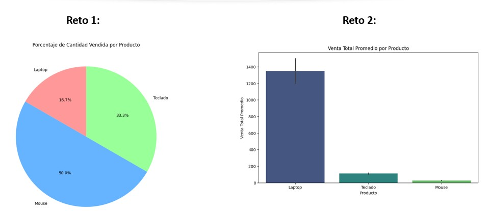

### 📈 Práctica 1.2: Visualización con Matplotlib y Seaborn

### **Objetivos**

  * Comprender la importancia de la visualización de datos.
  * Aprender a crear gráficos básicos con **Matplotlib**.
  * Usar **Seaborn** para crear gráficos más avanzados y estéticos.
  * Analizar los datos de un `DataFrame` a través de la visualización.

**Duración aproximada:**
- 60 minutos.

**Tabla de ayuda:**

Para la ejecución del código ingresar a https://colab.research.google.com/ 

### **1. Introducción a la Visualización de Datos**

La **visualización** es un paso crucial en el análisis de datos. Nos ayuda a entender la distribución, detectar patrones y descubrir relaciones entre variables. Usaremos dos librerías esenciales: **Matplotlib** y **Seaborn**.

-----

### **2. Gráficos Básicos con Matplotlib**

**Matplotlib** es la librería más popular para crear gráficos en Python. Nos permite tener un control total sobre cada elemento del gráfico.

#### **Ejercicio**

Usa un `DataFrame` con datos de ventas para crear un **gráfico de barras** que muestre la venta total por cada producto.

```python
import pandas as pd
import matplotlib.pyplot as plt

# Datos de ventas incrustados
data = {'Producto': ['Laptop', 'Laptop', 'Teclado', 'Teclado', 'Mouse', 'Mouse'],
        'Cantidad': [1, 1, 2, 2, 3, 3],
        'VentaTotal': [1200, 1500, 100, 120, 25, 30]}
ventas_df = pd.DataFrame(data)

# Agrupar las ventas por producto
ventas_por_producto = ventas_df.groupby('Producto')['VentaTotal'].sum()

# Crear el gráfico de barras
plt.figure(figsize=(10, 6))
plt.bar(ventas_por_producto.index, ventas_por_producto.values, color='skyblue')
plt.title('Venta Total por Producto')
plt.xlabel('Producto')
plt.ylabel('Venta Total')
plt.grid(axis='y', linestyle='--')
plt.show()
```

#### **Reto**

Crea un **gráfico de pastel** (*pie chart*) para visualizar el porcentaje de la `cantidad` vendida de cada producto.

```python
# Pista: Usa el método .pie() de matplotlib.pyplot
# Agrupa los datos por 'Producto' y suma la 'Cantidad'
cantidad_por_producto = ventas_df.groupby('Producto')['Cantidad'].sum()

# Tu código aquí
```

-----

### **3. Gráficos Más Atractivos con Seaborn**

**Seaborn** es una librería de alto nivel que simplifica la creación de gráficos estadísticos complejos y estéticos. Es ideal para explorar las relaciones entre variables.

#### **Ejercicio**

Usa el mismo `DataFrame` de ventas para crear un **gráfico de dispersión** que muestre la relación entre la `Cantidad` vendida y la `VentaTotal`.

```python
import seaborn as sns
import matplotlib.pyplot as plt
import pandas as pd

# Datos de ventas incrustados
data = {'Producto': ['Laptop', 'Laptop', 'Teclado', 'Teclado', 'Mouse', 'Mouse'],
        'Cantidad': [1, 1, 2, 2, 3, 3],
        'VentaTotal': [1200, 1500, 100, 120, 25, 30]}
ventas_df = pd.DataFrame(data)

# Crear el gráfico de dispersión con Seaborn
plt.figure(figsize=(10, 6))
sns.scatterplot(x='Cantidad', y='VentaTotal', data=ventas_df, hue='Producto', s=100)
plt.title('Relación entre Cantidad y Venta Total por Producto')
plt.xlabel('Cantidad Vendida')
plt.ylabel('Venta Total')
plt.show()
```

#### **Reto**

Crea un **gráfico de barras** utilizando Seaborn para mostrar la `venta total promedio` por producto.

```python
# Pista: Usa sns.barplot()
# Los datos ya están listos en ventas_df
# Seaborn calculará automáticamente el promedio si se lo indicas

# Tu código aquí
```

### Resultado esperado

