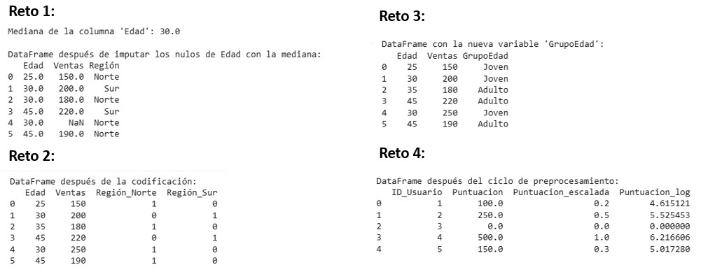

# Práctica 2.1. Limpieza, transformación y *Feature Engineering*

## Objetivos
Al finalizar la práctica, serás capaz de:
  * Comprender y aplicar técnicas de **limpieza de datos** para manejar valores nulos y atípicos.
  * Realizar **transformaciones** esenciales como el escalado de datos numéricos y la codificación de variables categóricas.
  * Crear nuevas variables (*features*) a través del ***Feature Engineering*** para mejorar el rendimiento de los modelos.

**Duración aproximada**
- 60 minutos.

## Instrucciones
Para la ejecución del código, ingresa a https://colab.research.google.com/ 

**Limpieza de datos: nulos y *Outliers***

Antes de analizar los datos, es vital asegurarte de que estén limpios. Los **valores nulos** (`NaN`) y los **valores atípicos** (*outliers*) pueden sesgar los resultados.

### Tarea 1. Gestión de valores nulos

**Paso 1.** Identifica los valores nulos en el *DataFrame* y usa la imputación por la media para rellenarlos.

```python
import pandas as pd
import numpy as np

# Datos de ejemplo con valores nulos
data = {'Edad': [25, 30, np.nan, 45, 30, 45],
        'Ventas': [150, 200, 180, 220, np.nan, 190],
        'Región': ['Norte', 'Sur', 'Norte', 'Sur', 'Norte', 'Norte']}
df_ejemplo = pd.DataFrame(data)

print("DataFrame con valores nulos:")
print(df_ejemplo)
print("-" * 30)

# Calcular la media de la columna 'Ventas'
media_ventas = df_ejemplo['Ventas'].mean()
print(f"Media de la columna 'Ventas': {media_ventas}")

# Imputar valores nulos con la media
df_ejemplo['Ventas'] = df_ejemplo['Ventas'].fillna(media_ventas)

print("DataFrame después de la imputación:")
print(df_ejemplo)
```

**Paso 2.** En el *DataFrame* anterior, identifica los nulos en la columna `Edad` y usa la **imputación por la mediana** para rellenarlos. Explica brevemente por qué la mediana puede ser una mejor opción que la media.

```python
# Pista de Código para el Reto:
# Pista 1. El método .median() te dará la mediana de una columna.
# Pista 2. El método .fillna() es el mismo que se usó para las ventas.
# Pista 3. La mediana es más robusta frente a valores atípicos.

# Tu código aquí
```

-----

**Transformación de datos: escalado y codificación**

Para que los modelos de *machine learning* funcionen correctamente, los datos a menudo deben transformarse. El **escalado** pone las variables en la misma escala, mientras que la **codificación** convierte variables categóricas en números.

### Tarea 2. Escalado de datos numéricos

**Paso 1.** Usa el `StandardScaler` de Scikit-learn para escalar las columnas `Ventas` y `Edad`.

```python
from sklearn.preprocessing import StandardScaler
import pandas as pd

# Datos de ejemplo
data = {'Edad': [25, 30, 35, 45, 30, 45],
        'Ventas': [150, 200, 180, 220, 250, 190]}
df_transformacion = pd.DataFrame(data)

# Inicializar el escalador
scaler = StandardScaler()

# Escalar las columnas numéricas
df_scaled = scaler.fit_transform(df_transformacion[['Edad', 'Ventas']])

# Convertir el resultado a un DataFrame para visualizar
df_scaled = pd.DataFrame(df_scaled, columns=['Edad_escalada', 'Ventas_escaladas'])

print("DataFrame después del escalado:")
print(df_scaled)
```

**Paso 2.** Codifica la columna `Región` usando ***One-Hot Encoding*** para convertir las categorías en columnas numéricas. Explica por qué esta técnica es útil para el *machine learning*.

```python
# Pista de código para el reto:
# Pista 1. Pandas tiene una función muy útil para esto: pd.get_dummies().
# Pista 2. La técnica de One-Hot Encoding crea una nueva columna por cada categoría.
# Pista 3. Los modelos de ML no pueden trabajar directamente con texto.

# Tu código aquí
```

-----

**Feature Engineering básico**

El ***Feature Engineering*** es el proceso de crear nuevas variables a partir de las existentes. Una buena *feature* puede mejorar significativamente el rendimiento del modelo.

### Tarea 3. Creación de variables derivadas

**Paso 1.** Crea una nueva columna llamada `VentaPorEdad` que sea el resultado de dividir `Ventas` entre `Edad`.

```python
import pandas as pd

# DataFrame con datos limpios
data = {'Edad': [25, 30, 35, 45, 30, 45],
        'Ventas': [150, 200, 180, 220, 250, 190]}
df_fe = pd.DataFrame(data)

# Crear la nueva feature
df_fe['VentaPorEdad'] = df_fe['Ventas'] / df_fe['Edad']

print("DataFrame con la nueva variable:")
print(df_fe)
```

**Paso 2.** A partir de la columna `Edad`, crea una nueva *feature* categórica llamada `GrupoEdad` con las siguientes categorías: `'Joven'` (menor a 35) y `'Adulto'` (35 o más).

```python
# Pistas de código para el reto:
# Pista 1. Puedes usar el método .apply() de Pandas con una función lambda.
# Pista 2. El método .apply() se ejecuta sobre cada elemento de la serie.
# Pista 3. La sintaxis para la función lambda es "lambda x: ...".

# Tu código aquí
```

-----

### Tarea 4. Reto final de código: ciclo de preprocesamiento completo 

**Descripción del problema**
Tienes un conjunto de datos desordenado. Tu objetivo es aplicar todo lo aprendido en esta práctica para prepararlo para un modelo de *machine learning*.


**Paso 1.** **Limpieza.** Imputa los valores nulos de la columna `Puntuacion` con el valor 0.

**Paso 2.** **Transformación.** Escala la columna `Puntuacion`.

**Paso 3.** **Feature Engineering.** Crea una nueva variable llamada `Puntuacion_log` aplicando el logaritmo natural (`np.log()`) a la columna `Puntuacion`.

<!-- end list -->

```python
# Pista de Código para el Reto:
import pandas as pd
import numpy as np
from sklearn.preprocessing import MinMaxScaler

# Datos de ejemplo
datos_reto = {'ID_Usuario': [1, 2, 3, 4, 5],
              'Puntuacion': [100, 250, np.nan, 500, 150]}
df_reto = pd.DataFrame(datos_reto)

# Pista 1. Usa .fillna(0) para la imputación.
# Pista 2. Usa MinMaxScaler() en lugar de StandardScaler() para este reto.
# Pista 3. El logaritmo se aplica a una columna completa.

# Tu código aquí
```
### Resultado esperado

