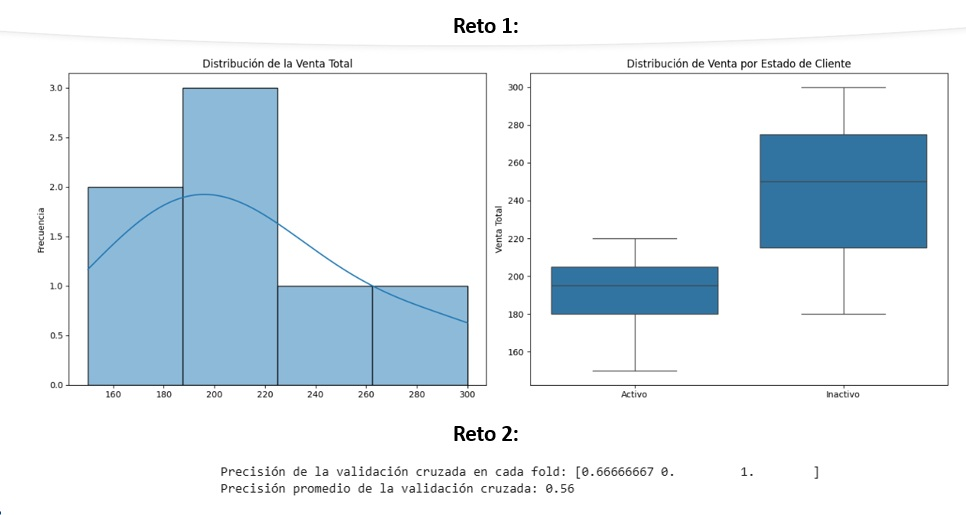

# Práctica 2.2. Análisis exploratorio y preparación de datos

## Objetivos
Al finalizar la práctica, serás capaz de:
  * Realizar un **análisis exploratorio de datos (EDA)** utilizando visualizaciones.
  * Comprender la importancia de dividir los datos en conjuntos de **entrenamiento y prueba**.
  * Conocer el concepto de **validación cruzada** para evaluar modelos de manera robusta.

**Duración aproximada**
- 60 minutos.

## Instrucciones
Para la ejecución del código, ingresa a https://colab.research.google.com/

### Tarea 1. Análisis exploratorio con visualizaciones

El **Análisis exploratorio de datos (EDA)** es un paso clave para entender las características de un conjunto de datos. Las visualizaciones nos permiten identificar patrones, tendencias y la distribución de las variables.

**Paso 1.** Usa un conjunto de datos simple para visualizar la relación entre `Edad` y `VentaTotal`, diferenciando a los clientes por su `Estado` (`Activo/Inactivo`).

```python
import pandas as pd
import seaborn as sns
import matplotlib.pyplot as plt

# Datos de ejemplo
data = {'Edad': [25, 30, 45, 50, 28, 35, 60],
        'VentaTotal': [150, 200, 180, 220, 250, 190, 300],
        'Estado': ['Activo', 'Activo', 'Inactivo', 'Activo', 'Inactivo', 'Activo', 'Inactivo']}
df_exploracion = pd.DataFrame(data)

# Crear un gráfico de dispersión para visualizar la relación
plt.figure(figsize=(8, 5))
sns.scatterplot(x='Edad', y='VentaTotal', hue='Estado', data=df_exploracion, s=100)
plt.title('Venta Total vs. Edad por Estado de Cliente')
plt.xlabel('Edad')
plt.ylabel('Venta Total')
plt.show()
```

**Paso 2.** Crea un **histograma** que muestre la distribución de la `VentaTotal` y un **gráfico de caja** (*boxplot*) que visualice la distribución de las ventas para cada `Estado`.

```python
# Pista de código para el reto:
# Pista 1. Usa sns.histplot() o plt.hist() para el histograma.
# Pista 2. Usa sns.boxplot() para el gráfico de caja.

# Tu código aquí
```

-----

### Tarea 2. Separación *train/test* y validación cruzada

Antes de entrenar un modelo, debes dividir nuestros datos para evaluar su rendimiento de forma objetiva.

  * **División *Train/Test***. Separa el conjunto de datos en dos partes. El **conjunto de entrenamiento** se usa para que el modelo aprenda y el **conjunto de prueba** se usa para evaluar su rendimiento en datos que nunca ha visto. Esto previene el sobreajuste (*overfitting*).
  * **Validación Cruzada (*Cross-Validation*)**. Es una técnica más robusta para evaluar un modelo. En lugar de una sola división, el conjunto de datos se divide en `k` particiones (*folds*). El modelo se entrena `k` veces, usando un *fold* diferente como conjunto de prueba en cada iteración. El rendimiento final es el promedio de todas las evaluaciones. Esto reduce la varianza de la evaluación.

**Paso 1.** Divide el *DataFrame* en un conjunto de entrenamiento y uno de prueba usando una proporción de 80/20.

```python
from sklearn.model_selection import train_test_split
import pandas as pd

# Datos de ejemplo
data = {'Edad': [25, 30, 45, 50, 28, 35, 60],
        'VentaTotal': [150, 200, 180, 220, 250, 190, 300],
        'Estado': ['Activo', 'Activo', 'Inactivo', 'Activo', 'Inactivo', 'Activo', 'Inactivo']}
df_exploracion = pd.DataFrame(data)
X = df_exploracion[['Edad', 'VentaTotal']] # Features (variables de entrada)
y = df_exploracion['Estado'] # Target (variable a predecir)

# Dividir los datos 80/20
X_train, X_test, y_train, y_test = train_test_split(X, y, test_size=0.2, random_state=42)

print("Forma del conjunto de entrenamiento (X_train):", X_train.shape)
print("Forma del conjunto de prueba (X_test):", X_test.shape)
```

**Paso 2.** Realiza una validación cruzada de 3 *folds* utilizando un clasificador `LogisticRegression` sobre el *DataFrame* `X` e `y` definidos en el ejercicio. Imprime el promedio de la precisión de la validación cruzada.

```python
# Pista de Código para el Reto:
# Pista 1. Importa cross_val_score y LogisticRegression.
# Pista 2. Define el modelo y luego usa cross_val_score.
# Pista 3. cross_val_score(modelo, X, y, cv=3, scoring='accuracy').

# Tu código aquí
```
### Resultado esperado

