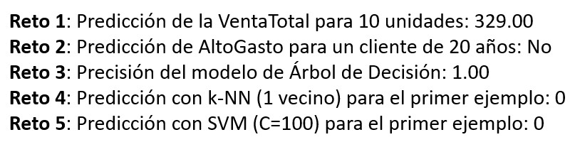
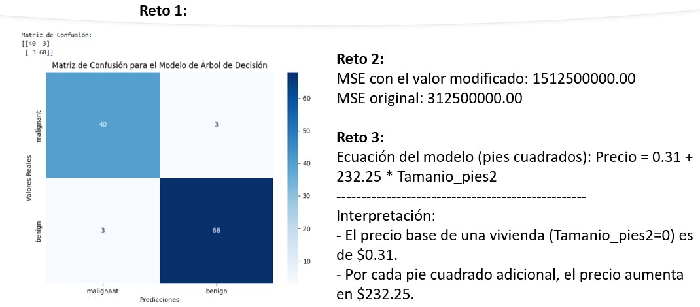

### **Práctica 3.1: Modelos de *Machine Learning* Fundamentales**

**Objetivos de la Práctica** 🎯

  * Conocer la librería **Scikit-learn**, el pilar del *machine learning* en Python.
  * Aplicar y comprender modelos de **regresión** (Regresión Lineal) y **clasificación** (Regresión Logística).
  * Explorar modelos de clasificación más avanzados como **Árboles de Decisión**, **k-NN** y **SVM**.
  * Entrenar, predecir y evaluar el rendimiento de los modelos.

**Duración aproximada:**
- 60 minutos.

**Tabla de ayuda:**

Para la ejecución del código ingresar a https://colab.research.google.com/ 

### **1. Introducción a Scikit-learn**

**Scikit-learn** es la librería de *machine learning* más popular en Python. Su principal fortaleza es su API consistente, lo que significa que el proceso para usar casi cualquier modelo es el mismo:

1.  **Importar** el modelo.
2.  **Instanciar** el modelo (`modelo = Modelo()`).
3.  **Entrenar** el modelo con los datos de entrenamiento (`modelo.fit(X_train, y_train)`).
4.  **Predecir** sobre nuevos datos (`modelo.predict(X_test)`).
5.  **Evaluar** el rendimiento.

-----

### **2. Regresión Lineal y Regresión Logística**

Estos modelos son la base del *machine learning* supervisado. La **regresión lineal** predice un valor numérico, mientras que la **regresión logística** predice una categoría.

#### **Ejercicio: Regresión Lineal**

Entrena un modelo de regresión lineal para predecir la `VentaTotal` basándose en la `Cantidad`.

```python
import pandas as pd
from sklearn.linear_model import LinearRegression

# Datos de ventas
data_ventas = {'Cantidad': [1, 2, 3, 4, 5],
               'VentaTotal': [50, 80, 110, 150, 170]}
df_ventas = pd.DataFrame(data_ventas)

# Variables (features y target)
X = df_ventas[['Cantidad']]
y = df_ventas['VentaTotal']

# 1. Instanciar el modelo
modelo_lineal = LinearRegression()

# 2. Entrenar el modelo
modelo_lineal.fit(X, y)

# 3. Predecir (con la corrección)
prediccion_df = pd.DataFrame([[6]], columns=['Cantidad'])
prediccion = modelo_lineal.predict(prediccion_df)

print(f"Predicción de la VentaTotal para 6 unidades: {prediccion[0]:.2f}")
```

**Reto:** Utiliza el modelo de regresión lineal entrenado para predecir la `VentaTotal` de **10** unidades y muestra el resultado.

```python
# Pista de código para el reto:
# Pista: No necesitas entrenar el modelo de nuevo.

# Tu código aquí
```

-----

#### **Ejercicio: Regresión Logística**

Entrena un modelo de regresión logística para predecir si un cliente tiene un `AltoGasto` (Sí/No) basado en su `Edad`.

```python
import pandas as pd
from sklearn.linear_model import LogisticRegression

# Datos de clientes
data_clientes = {'Edad': [25, 30, 45, 50, 28],
                 'AltoGasto': ['No', 'No', 'Sí', 'Sí', 'No']}
df_clientes = pd.DataFrame(data_clientes)

# Variables (features y target)
X = df_clientes[['Edad']]
y = df_clientes['AltoGasto']

# 1. Instanciar el modelo
modelo_logistico = LogisticRegression()

# 2. Entrenar el modelo
modelo_logistico.fit(X, y)

# 3. Predecir (con la corrección)
prediccion_log_df = pd.DataFrame([[40]], columns=['Edad'])
prediccion_log = modelo_logistico.predict(prediccion_log_df)
print(f"Predicción de AltoGasto para un cliente de 40 años: {prediccion_log[0]}")
```

**Reto:** Utiliza el modelo de regresión logística entrenado para predecir si un cliente de **20** años tendrá un `AltoGasto`.

```python
# Pista de código para el reto:
# Pista: Usa el mismo método .predict() que en el ejercicio.

# Tu código aquí
```

-----

### **3. Árboles de Decisión, k-NN y SVM**

Estos son modelos de clasificación más avanzados y versátiles. El **Árbol de Decisión** toma decisiones secuenciales, **k-NN** clasifica un punto basándose en sus vecinos más cercanos, y **SVM** encuentra la mejor frontera de decisión entre clases.

#### **Ejercicio: Árbol de Decisión**

Entrena un Árbol de Decisión para clasificar el tipo de flor (Iris) basándose en sus medidas.

```python
from sklearn.tree import DecisionTreeClassifier
from sklearn.datasets import load_iris
import pandas as pd

# Cargar el dataset de Iris
iris = load_iris()
X = pd.DataFrame(iris.data, columns=iris.feature_names)
y = pd.Series(iris.target)

# 1. Instanciar el modelo
arbol_decision = DecisionTreeClassifier(random_state=42)

# 2. Entrenar el modelo
arbol_decision.fit(X, y)

# 3. Predecir (usando un ejemplo del dataset)
# Se toman los valores de la primera fila
prediccion_arbol = arbol_decision.predict(X.iloc[[0]])
print(f"Predicción para el primer ejemplo: {prediccion_arbol[0]}")
```

**Reto:** Usa la función `accuracy_score` para evaluar la precisión del modelo de Árbol de Decisión con el conjunto de datos completo (`X` y `y`).

```python
# Pista de código para el reto:
# Pista: Importa accuracy_score de sklearn.metrics.
# Pista: Compara las predicciones con los valores reales.

# Tu código aquí
```

-----

#### **Ejercicio: k-NN (k-Nearest Neighbors)**

Entrena un clasificador k-NN para el mismo dataset de Iris.

```python
from sklearn.neighbors import KNeighborsClassifier
from sklearn.datasets import load_iris
import pandas as pd

iris = load_iris()
X = pd.DataFrame(iris.data, columns=iris.feature_names)
y = pd.Series(iris.target)

# 1. Instanciar el modelo con 3 vecinos
k_nn = KNeighborsClassifier(n_neighbors=3)

# 2. Entrenar el modelo
k_nn.fit(X, y)

# 3. Predecir
prediccion_knn = k_nn.predict(X.iloc[[0]])
print(f"Predicción con k-NN para el primer ejemplo: {prediccion_knn[0]}")
```

**Reto:** ¿Cómo cambiaría la precisión del modelo si usáramos solo 1 vecino en lugar de 3? Modifica el modelo `k_nn` con `n_neighbors=1` y re-entrénalo para ver el resultado.

```python
# Pista de código para el reto:
# Pista: Solo necesitas cambiar el parámetro en KNeighborsClassifier().

# Tu código aquí
```

-----

#### **Ejercicio: SVM (Support Vector Machine)**

Entrena un clasificador SVM para el mismo dataset de Iris.

```python
from sklearn.svm import SVC
from sklearn.datasets import load_iris
import pandas as pd

iris = load_iris()
X = pd.DataFrame(iris.data, columns=iris.feature_names)
y = pd.Series(iris.target)

# 1. Instanciar el modelo
svm_model = SVC(random_state=42)

# 2. Entrenar el modelo
svm_model.fit(X, y)

# 3. Predecir
prediccion_svm = svm_model.predict(X.iloc[[0]])
print(f"Predicción con SVM para el primer ejemplo: {prediccion_svm[0]}")
```

**Reto:** El parámetro `C` en `SVC()` controla la penalización por una clasificación incorrecta. Crea un nuevo modelo SVM con `C=100` y re-entrénalo para ver si la predicción para el primer ejemplo cambia.

```python
# Pista de código para el reto:
# Pista: El parámetro C se pone directamente en el constructor de SVC().

# Tu código aquí
```

-----

### **Aclaración sobre los Resultados del Ejercicio 3** 🧠

Es normal que las predicciones en los ejercicios de Árbol de Decisión, k-NN y SVM den **0**. Esto se debe a que la primera fila del conjunto de datos de Iris, que es el ejemplo que se utiliza para la predicción, corresponde a la clase de flor `Iris-setosa`, que está codificada numéricamente como **0**.

Cuando un modelo se entrena y luego se le pide que prediga una muestra que ya ha visto, lo más probable es que la clasifique correctamente, produciendo el valor esperado.

### Resultado esperado


### **Práctica 3.2: Evaluación e Interpretación de Modelos**

**Objetivos de la Práctica** 🎯

  * Comprender las principales **métricas de evaluación** para modelos de regresión y clasificación.
  * Aprender a calcular y usar métricas como **`accuracy`**, **`precision`**, **`recall`**, **`F1-score`**, **`R²`**, **`MAE`** y **`MSE`**.
  * Realizar una **interpretación básica** de los resultados de un modelo de regresión lineal.

**Duración aproximada:**
- 60 minutos.

**Tabla de ayuda:**

Para la ejecución del código ingresar a https://colab.research.google.com/ 

### **1. Métricas de Evaluación**

Las métricas nos permiten cuantificar qué tan bien se desempeña un modelo. Para la **clasificación**, evaluamos qué tan correctas son las predicciones (por ejemplo, si un email es spam o no). Para la **regresión**, evaluamos qué tan cerca están las predicciones de los valores reales.

#### **Ejercicio: Métricas de Clasificación (`accuracy`, `precision`, `recall`, `F1-score`)**

Usa un modelo de `DecisionTreeClassifier` para clasificar tumores como benignos (0) o malignos (1) y evalúa su rendimiento con varias métricas.

```python
import pandas as pd
from sklearn.model_selection import train_test_split
from sklearn.tree import DecisionTreeClassifier
from sklearn.metrics import accuracy_score, precision_score, recall_score, f1_score
from sklearn.datasets import load_breast_cancer

# Cargar el dataset de cáncer de mama
cancer = load_breast_cancer()
X = pd.DataFrame(cancer.data, columns=cancer.feature_names)
y = pd.Series(cancer.target)

# Dividir los datos
X_train, X_test, y_train, y_test = train_test_split(X, y, test_size=0.2, random_state=42)

# Entrenar el modelo
modelo_clasificacion = DecisionTreeClassifier(random_state=42)
modelo_clasificacion.fit(X_train, y_train)

# Predecir sobre el conjunto de prueba
predicciones = modelo_clasificacion.predict(X_test)

# Calcular métricas
accuracy = accuracy_score(y_test, predicciones)
precision = precision_score(y_test, predicciones)
recall = recall_score(y_test, predicciones)
f1 = f1_score(y_test, predicciones)

print(f"Accuracy: {accuracy:.2f}")
print(f"Precision: {precision:.2f}")
print(f"Recall: {recall:.2f}")
print(f"F1-score: {f1:.2f}")
```

**Reto:** Utiliza la función `confusion_matrix` de `sklearn.metrics` para visualizar los resultados de las predicciones del ejercicio.

```python
# Pista de código para el reto:
# Pista: Importa la función y pásale los valores reales y las predicciones.

# Tu código aquí
```

-----

#### **Ejercicio: Métricas de Regresión (`R²`, `MAE`, `MSE`)**

Entrena un modelo de `LinearRegression` para predecir precios de viviendas y evalúa su rendimiento.

```python
import pandas as pd
from sklearn.model_selection import train_test_split
from sklearn.linear_model import LinearRegression
from sklearn.metrics import r2_score, mean_absolute_error, mean_squared_error

# Datos de ejemplo
data_viviendas = {'Tamanio_m2': [60, 80, 100, 120, 150],
                  'Precio': [150000, 200000, 250000, 300000, 350000]}
df_viviendas = pd.DataFrame(data_viviendas)

# Dividir los datos
X = df_viviendas[['Tamanio_m2']]
y = df_viviendas['Precio']
X_train, X_test, y_train, y_test = train_test_split(X, y, test_size=0.4, random_state=42)

# Entrenar el modelo
modelo_regresion = LinearRegression()
modelo_regresion.fit(X_train, y_train)

# Predecir sobre el conjunto de prueba
predicciones_regresion = modelo_regresion.predict(X_test)

# Calcular métricas
r2 = r2_score(y_test, predicciones_regresion)
mae = mean_absolute_error(y_test, predicciones_regresion)
mse = mean_squared_error(y_test, predicciones_regresion)

print(f"R² (Coeficiente de determinación): {r2:.2f}")
print(f"MAE (Error absoluto medio): {mae:.2f}")
print(f"MSE (Error cuadrático medio): {mse:.2f}")
```

**Reto:** ¿Cómo cambia el **MSE** si la predicción para la última vivienda (`Tamanio_m2` = 150) es de 320,000 en lugar de 350,000? Reemplaza el valor real con este nuevo dato y vuelve a calcular el MSE.

```python
# Pista de código para el reto:
# Pista: Cambia el valor en y_test antes de calcular el MSE.

# Tu código aquí
```

-----

### **2. Interpretación Básica de Modelos**

Interpretar un modelo significa entender por qué hace ciertas predicciones. Para la **regresión lineal**, esto es muy sencillo: los **coeficientes** (`.coef_`) y la **intersección** (`.intercept_`) nos indican la relación entre las variables.

#### **Ejercicio:**

Interpreta el modelo de `LinearRegression` del ejercicio anterior para entender cómo el tamaño de la vivienda afecta el precio.

```python
# La intersección (intercept) es el valor de y cuando X es 0
intercepto = modelo_regresion.intercept_
# El coeficiente es el cambio en y por cada cambio de 1 unidad en X
coeficiente = modelo_regresion.coef_[0]

print(f"Ecuación del modelo: Precio = {intercepto:.2f} + {coeficiente:.2f} * Tamanio_m2")
print("-" * 50)
print(f"Interpretación:")
print(f"- El precio base de una vivienda (Tamanio_m2=0) es de ${intercepto:.2f}.")
print(f"- Por cada metro cuadrado adicional, el precio aumenta en ${coeficiente:.2f}.")
```

**Reto:** Reentrena el modelo de regresión lineal, pero esta vez con un nuevo conjunto de datos donde el tamaño está en pies cuadrados. Interpreta el nuevo coeficiente y compáralo con el anterior.

```python
# Pista de código para el reto:
# Pista: Los coeficientes cambiarán según la escala de la variable.

# Tu código aquí
```

### Resultado esperado

