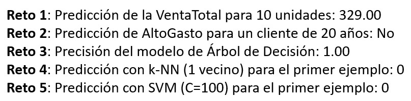

# Práctica 3.1. Modelos de *machine learning* fundamentales

## Objetivos
Al finalizar la práctica, serás capaz de:

  * Conocer la librería **Scikit-learn**, el pilar del *machine learning* en Python.
  * Aplicar y comprender modelos de **regresión** (regresión lineal) y **clasificación** (regresión logística).
  * Explorar modelos de clasificación más avanzados como **árboles de decisión**, **k-NN** y **SVM**.
  * Entrenar, predecir y evaluar el rendimiento de los modelos.

**Duración aproximada**
- 60 minutos.

## Instrucciones
Para la ejecución del código, ingresa a https://colab.research.google.com/

#### 1. Introducción a Scikit-learn

**Scikit-learn** es la librería de *machine learning* más popular en Python. Su principal fortaleza es su API consistente, lo que significa que el proceso para usar casi cualquier modelo es el mismo:

1.  **Importar** el modelo.
2.  **Instanciar** el modelo (`modelo = Modelo()`).
3.  **Entrenar** el modelo con los datos de entrenamiento (`modelo.fit(X_train, y_train)`).
4.  **Predecir** sobre nuevos datos (`modelo.predict(X_test)`).
5.  **Evaluar** el rendimiento.

-----

#### 2. Regresión lineal y regresión logística

Estos modelos son la base del *machine learning* supervisado. La **regresión lineal** predice un valor numérico, mientras que la **regresión logística** predice una categoría.

### Tarea 1. Regresión lineal

**Paso 1.** Entrena un modelo de regresión lineal para predecir la `VentaTotal` basándose en la `Cantidad`.

```python
import pandas as pd
from sklearn.linear_model import LinearRegression

# Datos de ventas
data_ventas = {'Cantidad': [1, 2, 3, 4, 5],
               'VentaTotal': [50, 80, 110, 150, 170]}
df_ventas = pd.DataFrame(data_ventas)

# Variables (features y target)
X = df_ventas[['Cantidad']]
y = df_ventas['VentaTotal']

# 1. Instanciar el modelo
modelo_lineal = LinearRegression()

# 2. Entrenar el modelo
modelo_lineal.fit(X, y)

# 3. Predecir (con la corrección)
prediccion_df = pd.DataFrame([[6]], columns=['Cantidad'])
prediccion = modelo_lineal.predict(prediccion_df)

print(f"Predicción de la VentaTotal para 6 unidades: {prediccion[0]:.2f}")
```

**Paso 2.** Utiliza el modelo de regresión lineal entrenado para predecir la `VentaTotal` de **10** unidades y muestra el resultado.

```python
# Pista de código para el reto:
# Pista: No necesitas entrenar el modelo de nuevo.

# Tu código aquí
```

-----

### Tarea 2. Regresión logística

**Paso 1.** Entrena un modelo de regresión logística para predecir si un cliente tiene un `AltoGasto` (Sí/No) basado en su `Edad`.

```python
import pandas as pd
from sklearn.linear_model import LogisticRegression

# Datos de clientes
data_clientes = {'Edad': [25, 30, 45, 50, 28],
                 'AltoGasto': ['No', 'No', 'Sí', 'Sí', 'No']}
df_clientes = pd.DataFrame(data_clientes)

# Variables (features y target)
X = df_clientes[['Edad']]
y = df_clientes['AltoGasto']

# 1. Instanciar el modelo
modelo_logistico = LogisticRegression()

# 2. Entrenar el modelo
modelo_logistico.fit(X, y)

# 3. Predecir (con la corrección)
prediccion_log_df = pd.DataFrame([[40]], columns=['Edad'])
prediccion_log = modelo_logistico.predict(prediccion_log_df)
print(f"Predicción de AltoGasto para un cliente de 40 años: {prediccion_log[0]}")
```

**Paso 2.** Utiliza el modelo de regresión logística entrenado para predecir si un cliente de **20** años tendrá un `AltoGasto`.

```python
# Pista de código para el reto:
# Pista: Usa el mismo método .predict() que en el ejercicio.

# Tu código aquí
```

-----

#### Árboles de decisión, k-NN y SVM

Estos son modelos de clasificación más avanzados y versátiles. El **árbol de decisión** toma decisiones secuenciales, **k-NN** clasifica un punto basándose en sus vecinos más cercanos, y **SVM** encuentra la mejor frontera de decisión entre clases.

### Tarea 3. Árbol de decisión

**Paso 1.** Entrena un árbol de decisión para clasificar el tipo de flor (Iris) basándose en sus medidas.

```python
from sklearn.tree import DecisionTreeClassifier
from sklearn.datasets import load_iris
import pandas as pd

# Cargar el dataset de Iris
iris = load_iris()
X = pd.DataFrame(iris.data, columns=iris.feature_names)
y = pd.Series(iris.target)

# 1. Instanciar el modelo
arbol_decision = DecisionTreeClassifier(random_state=42)

# 2. Entrenar el modelo
arbol_decision.fit(X, y)

# 3. Predecir (usando un ejemplo del dataset)
# Se toman los valores de la primera fila
prediccion_arbol = arbol_decision.predict(X.iloc[[0]])
print(f"Predicción para el primer ejemplo: {prediccion_arbol[0]}")
```

**Paso 2.** Usa la función `accuracy_score` para evaluar la precisión del modelo de árbol de decisión con el conjunto de datos completo (`X` y `y`).

```python
# Pista de código para el reto:
# Pista: Importa accuracy_score de sklearn.metrics.
# Pista: Compara las predicciones con los valores reales.

# Tu código aquí
```

-----

### Tarea 4. k-NN (k-Nearest Neighbors)**

**Paso 1.** Entrena un clasificador k-NN para el mismo dataset de Iris.

```python
from sklearn.neighbors import KNeighborsClassifier
from sklearn.datasets import load_iris
import pandas as pd

iris = load_iris()
X = pd.DataFrame(iris.data, columns=iris.feature_names)
y = pd.Series(iris.target)

# 1. Instanciar el modelo con 3 vecinos
k_nn = KNeighborsClassifier(n_neighbors=3)

# 2. Entrenar el modelo
k_nn.fit(X, y)

# 3. Predecir
prediccion_knn = k_nn.predict(X.iloc[[0]])
print(f"Predicción con k-NN para el primer ejemplo: {prediccion_knn[0]}")
```

**Paso 2.** ¿Cómo cambiaría la precisión del modelo si usáramos solo 1 vecino en lugar de 3? Modifica el modelo `k_nn` con `n_neighbors=1` y reentrénalo para observar el resultado.

```python
# Pista de código para el reto:
# Pista: Solo necesitas cambiar el parámetro en KNeighborsClassifier().

# Tu código aquí
```

-----

### Tarea 5. SVM (Support Vector Machine)

**Paso 1.** Entrena un clasificador SVM para el mismo dataset de Iris.

```python
from sklearn.svm import SVC
from sklearn.datasets import load_iris
import pandas as pd

iris = load_iris()
X = pd.DataFrame(iris.data, columns=iris.feature_names)
y = pd.Series(iris.target)

# 1. Instanciar el modelo
svm_model = SVC(random_state=42)

# 2. Entrenar el modelo
svm_model.fit(X, y)

# 3. Predecir
prediccion_svm = svm_model.predict(X.iloc[[0]])
print(f"Predicción con SVM para el primer ejemplo: {prediccion_svm[0]}")
```

**Paso 2.**  El parámetro `C` en `SVC()` controla la penalización por una clasificación incorrecta. Crea un nuevo modelo SVM con `C=100` y re-entrénalo para ver si la predicción para el primer ejemplo cambia.

```python
# Pista de código para el reto:
# Pista: El parámetro C se pone directamente en el constructor de SVC().

# Tu código aquí
```

-----

**Aclaración sobre los resultados 🧠**

Es normal que las predicciones en las tareas 3, 4 y 5 den **0**. Esto se debe a que la primera fila del conjunto de datos de Iris, que es el ejemplo que se utiliza para la predicción, corresponde a la clase de flor `Iris-setosa`, que está codificada numéricamente como **0**.

Cuando un modelo se entrena y luego se le pide que prediga una muestra que ya ha visto, lo más probable es que la clasifique correctamente, produciendo el valor esperado.

### Resultado esperado



