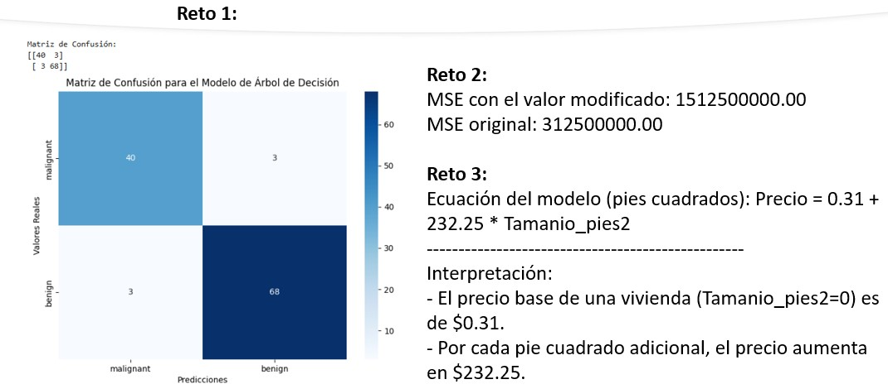

# Práctica 3.2. Evaluación e interpretación de modelos

## Objetivos
Al finalizar la práctica, serás capaz de:
  * Comprender las principales **métricas de evaluación** para modelos de regresión y clasificación.
  * Aprender a calcular y usar métricas como **`accuracy`**, **`precision`**, **`recall`**, **`F1-score`**, **`R²`**, **`MAE`** y **`MSE`**.
  * Realizar una **interpretación básica** de los resultados de un modelo de regresión lineal.

**Duración aproximada**
- 60 minutos.

## Instrucciones
Para la ejecución del código, ingresa a https://colab.research.google.com/


### Tarea 1. Métricas de clasificación (`accuracy`, `precision`, `recall`, `F1-score`)

#### Métricas de evaluación

Las métricas permiten cuantificar qué tan bien se desempeña un modelo. Para la **clasificación**, evalúa qué tan correctas son las predicciones (por ejemplo, si un email es *spam* o no). Para la **regresión**, evalúa qué tan cerca están las predicciones de los valores reales.

**Paso 1.**  Usa un modelo de `DecisionTreeClassifier` para clasificar tumores como benignos (0) o malignos (1) y evalúa su rendimiento con varias métricas.

```python
import pandas as pd
from sklearn.model_selection import train_test_split
from sklearn.tree import DecisionTreeClassifier
from sklearn.metrics import accuracy_score, precision_score, recall_score, f1_score
from sklearn.datasets import load_breast_cancer

# Cargar el dataset de cáncer de mama
cancer = load_breast_cancer()
X = pd.DataFrame(cancer.data, columns=cancer.feature_names)
y = pd.Series(cancer.target)

# Dividir los datos
X_train, X_test, y_train, y_test = train_test_split(X, y, test_size=0.2, random_state=42)

# Entrenar el modelo
modelo_clasificacion = DecisionTreeClassifier(random_state=42)
modelo_clasificacion.fit(X_train, y_train)

# Predecir sobre el conjunto de prueba
predicciones = modelo_clasificacion.predict(X_test)

# Calcular métricas
accuracy = accuracy_score(y_test, predicciones)
precision = precision_score(y_test, predicciones)
recall = recall_score(y_test, predicciones)
f1 = f1_score(y_test, predicciones)

print(f"Accuracy: {accuracy:.2f}")
print(f"Precision: {precision:.2f}")
print(f"Recall: {recall:.2f}")
print(f"F1-score: {f1:.2f}")
```

**Paso 2.** Utiliza la función `confusion_matrix` de `sklearn.metrics` para visualizar los resultados de las predicciones del ejercicio.

```python
# Pista de código para el reto:
# Pista: Importa la función y pásale los valores reales y las predicciones.

# Tu código aquí
```

-----

### Tarea 2. Métricas de regresión (`R²`, `MAE`, `MSE`)**

**Paso 1.**  Entrena un modelo de `LinearRegression` para predecir precios de viviendas y evalúa su rendimiento.

```python
import pandas as pd
from sklearn.model_selection import train_test_split
from sklearn.linear_model import LinearRegression
from sklearn.metrics import r2_score, mean_absolute_error, mean_squared_error

# Datos de ejemplo
data_viviendas = {'Tamanio_m2': [60, 80, 100, 120, 150],
                  'Precio': [150000, 200000, 250000, 300000, 350000]}
df_viviendas = pd.DataFrame(data_viviendas)

# Dividir los datos
X = df_viviendas[['Tamanio_m2']]
y = df_viviendas['Precio']
X_train, X_test, y_train, y_test = train_test_split(X, y, test_size=0.4, random_state=42)

# Entrenar el modelo
modelo_regresion = LinearRegression()
modelo_regresion.fit(X_train, y_train)

# Predecir sobre el conjunto de prueba
predicciones_regresion = modelo_regresion.predict(X_test)

# Calcular métricas
r2 = r2_score(y_test, predicciones_regresion)
mae = mean_absolute_error(y_test, predicciones_regresion)
mse = mean_squared_error(y_test, predicciones_regresion)

print(f"R² (Coeficiente de determinación): {r2:.2f}")
print(f"MAE (Error absoluto medio): {mae:.2f}")
print(f"MSE (Error cuadrático medio): {mse:.2f}")
```

**Paso 2.** ¿Cómo cambia el **MSE** si la predicción para la última vivienda (`Tamanio_m2` = 150) es de 320,000 en lugar de 350,000? Reemplaza el valor real con este nuevo dato y vuelve a calcular el MSE.

```python
# Pista de código para el reto:
# Pista: Cambia el valor en y_test antes de calcular el MSE.

# Tu código aquí
```

-----

### Tarea 3. Interpretación básica de modelos

Interpretar un modelo significa entender por qué hace ciertas predicciones. Para la **regresión lineal**, esto es muy sencillo: los **coeficientes** (`.coef_`) y la **intersección** (`.intercept_`) nos indican la relación entre las variables.

**Paso 1.** Interpreta el modelo de `LinearRegression` del ejercicio anterior para entender cómo el tamaño de la vivienda afecta el precio.

```python
# La intersección (intercept) es el valor de y cuando X es 0
intercepto = modelo_regresion.intercept_
# El coeficiente es el cambio en y por cada cambio de 1 unidad en X
coeficiente = modelo_regresion.coef_[0]

print(f"Ecuación del modelo: Precio = {intercepto:.2f} + {coeficiente:.2f} * Tamanio_m2")
print("-" * 50)
print(f"Interpretación:")
print(f"- El precio base de una vivienda (Tamanio_m2=0) es de ${intercepto:.2f}.")
print(f"- Por cada metro cuadrado adicional, el precio aumenta en ${coeficiente:.2f}.")
```

**Paso 2.** Reentrena el modelo de regresión lineal, pero esta vez con un nuevo conjunto de datos donde el tamaño está en pies cuadrados. Interpreta el nuevo coeficiente y compáralo con el anterior.

```python
# Pista de código para el reto:
# Pista: Los coeficientes cambiarán según la escala de la variable.

# Tu código aquí
```

### Resultado esperado

