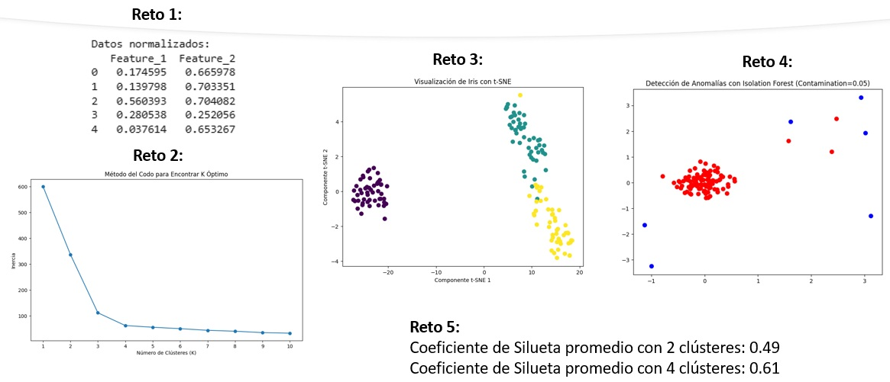

### 🕵️ Práctica 4.0: Fundamentos de Aprendizaje No Supervisado

¡Bienvenido a la práctica sobre el aprendizaje no supervisado\! Aquí exploraremos cómo descubrir patrones ocultos en los datos sin la ayuda de etiquetas.


**Objetivos de la Práctica** 🎯

  * Comprender las técnicas de **preprocesamiento** para datos no supervisados.
  * Aplicar los principales algoritmos de **clustering** y de **reducción de dimensionalidad**.
  * Usar métodos para la **detección de anomalías**.
  * Evaluar y validar los resultados de los modelos no supervisados utilizando métricas clave.

**Duración aproximada:**
- 90 minutos.

**Tabla de ayuda:**

Para la ejecución del código ingresar a https://colab.research.google.com/ 

### **1. Preprocesamiento Avanzado y Estructura de Datos**

En el aprendizaje no supervisado, el preprocesamiento es crucial porque los algoritmos como K-Means se basan en la distancia entre los puntos. Si las características tienen escalas muy diferentes, aquellas con valores más grandes dominarán la distancia, afectando los resultados.

Las técnicas principales son:

  * **Normalización (Min-Max Scaling)**: Escala los datos a un rango específico, generalmente `[0, 1]`.
  * **Estandarización (Standardization)**: Transforma los datos para que tengan una media de `0` y una desviación estándar de `1`.

**Ejercicio:**
Estandariza los datos de un conjunto de ejemplo utilizando `StandardScaler` de Scikit-learn.

```python
import pandas as pd
from sklearn.preprocessing import StandardScaler
from sklearn.datasets import make_blobs

# Generar datos de ejemplo
X, y = make_blobs(n_samples=300, centers=4, random_state=42, cluster_std=2.0)
df_datos = pd.DataFrame(X, columns=['Feature_1', 'Feature_2'])

print("Datos originales:")
print(df_datos.head())
print("-" * 30)

# Estandarizar los datos
scaler = StandardScaler()
df_escalado = pd.DataFrame(scaler.fit_transform(df_datos), columns=df_datos.columns)

print("Datos estandarizados:")
print(df_escalado.head())
```

**Reto:** Normaliza el mismo conjunto de datos `df_datos` usando `MinMaxScaler` y muestra los primeros 5 registros.

```python
# Pista de código para el reto:
# Pista: Importa la clase correcta y sigue los mismos pasos que para StandardScaler.
from sklearn.preprocessing import MinMaxScaler
# Tu código para instanciar el normalizador
# Tu código para normalizar los datos
```

-----

### **2. Algoritmos de Clustering: Fundamentos y Aplicaciones**

El **clustering** agrupa puntos de datos similares en conjuntos (clústeres) sin usar etiquetas. El algoritmo de clustering más popular es **K-Means**, que asigna cada punto al centroide más cercano.

**Ejercicio:**
Aplica el algoritmo K-Means al conjunto de datos estandarizado y visualiza los clústeres resultantes.

```python
import pandas as pd
import matplotlib.pyplot as plt
from sklearn.cluster import KMeans
from sklearn.preprocessing import StandardScaler
from sklearn.datasets import make_blobs

# Generar y estandarizar datos
X, y = make_blobs(n_samples=300, centers=4, random_state=42, cluster_std=2.0)
scaler = StandardScaler()
X_scaled = scaler.fit_transform(X)

# Aplicar K-Means con k=4
kmeans = KMeans(n_clusters=4, random_state=42, n_init='auto')
kmeans.fit(X_scaled)
etiquetas_cluster = kmeans.labels_

# Visualizar los clústeres
plt.figure(figsize=(8, 6))
plt.scatter(X_scaled[:, 0], X_scaled[:, 1], c=etiquetas_cluster, cmap='viridis', s=50)
plt.scatter(kmeans.cluster_centers_[:, 0], kmeans.cluster_centers_[:, 1], s=200, c='red', marker='X', label='Centroides')
plt.title('Clustering con K-Means')
plt.xlabel('Eje X (Escalado)')
plt.ylabel('Eje Y (Escalado)')
plt.legend()
plt.show()
```

**Reto:** Elige el número de clústeres óptimo para el conjunto de datos de ejemplo utilizando el **método del codo (*elbow method*)**.

```python
# Pista de código para el reto:
# Pista: Entrena K-Means en un bucle for, guardando el atributo '.inertia_'.
inercia = []
for k in range(1, 11):
    # Instancia y entrena KMeans para cada k
    # Almacena la inercia en la lista
    pass # Reemplaza esta línea con tu código
# Luego, grafica los resultados.
```

-----

### **3. Reducción de Dimensionalidad (PCA y t-SNE)**

La reducción de dimensionalidad es crucial para visualizar y procesar conjuntos de datos con muchas características.

  * **PCA (Análisis de Componentes Principales)**: Una técnica lineal que transforma los datos a un nuevo espacio de menor dimensión, preservando la mayor varianza posible.
  * **t-SNE (t-Distributed Stochastic Neighbor Embedding)**: Una técnica no lineal que es excelente para visualizar datos de alta dimensión, ya que prioriza la preservación de las distancias locales.

**Ejercicio:**
Aplica PCA para reducir la dimensionalidad del conjunto de datos de Iris a 2 componentes.

```python
import pandas as pd
import matplotlib.pyplot as plt
from sklearn.decomposition import PCA
from sklearn.datasets import load_iris

# Cargar el dataset de Iris
iris = load_iris()
X = iris.data
y = iris.target

# Aplicar PCA para reducir a 2 componentes
pca = PCA(n_components=2)
X_pca = pca.fit_transform(X)

# Visualizar el resultado
plt.figure(figsize=(8, 6))
plt.scatter(X_pca[:, 0], X_pca[:, 1], c=y, cmap='viridis', s=50)
plt.title('Visualización de Iris con PCA')
plt.xlabel('Componente Principal 1')
plt.ylabel('Componente Principal 2')
plt.show()
```

**Reto:** Aplica `t-SNE` al mismo conjunto de datos de Iris y visualiza el resultado. Compara la visualización con la de PCA.

```python
# Pista de código para el reto:
# Pista: Importa la clase TSNE y úsala de manera similar a PCA.
from sklearn.manifold import TSNE
# Tu código para instanciar TSNE
# Tu código para aplicar la transformación
# Tu código para graficar
```

-----

### **4. Detección de Anomalías (Isolation Forest)**

La detección de anomalías es la identificación de eventos o puntos inusuales que no se ajustan a un patrón esperado. `Isolation Forest` es un algoritmo que "aísla" las anomalías en árboles aleatorios, ya que los valores atípicos son más fáciles de separar de la mayoría de los datos.

**Ejercicio:**
Usa `IsolationForest` para detectar y visualizar anomalías en un conjunto de datos simple.

```python
import pandas as pd
import numpy as np
import matplotlib.pyplot as plt
from sklearn.ensemble import IsolationForest

# Generar datos normales
rng = np.random.RandomState(42)
X_normal = 0.3 * rng.randn(100, 2)
# Generar anomalías
X_anomalias = rng.uniform(low=-4, high=4, size=(10, 2))
X_completo = np.concatenate([X_normal, X_anomalias])

# Entrenar el modelo
modelo_anomalias = IsolationForest(contamination=0.1, random_state=42)
modelo_anomalias.fit(X_completo)

# Predecir las anomalías
predicciones = modelo_anomalias.predict(X_completo)

# Visualizar los resultados
plt.figure(figsize=(8, 6))
plt.scatter(X_completo[:, 0], X_completo[:, 1], c=predicciones, cmap='bwr', s=50)
plt.title('Detección de Anomalías con Isolation Forest')
plt.show()
```

**Reto:** Cambia el parámetro `contamination` de `0.1` a `0.05` y re-ejecuta el código. ¿Qué efecto tiene este cambio en la cantidad de anomalías detectadas?

```python
# Pista de código para el reto:
# Pista: Solo necesitas cambiar el valor del parámetro en la instanciación.
# modelo_anomalias = IsolationForest(contamination=0.05, ...)
# Tu código para entrenar y predecir
```

-----

### **5. Evaluación y Validación (Coeficiente de Silueta)**

Evaluar modelos de clustering es un desafío, ya que no hay etiquetas reales. El **Coeficiente de Silueta** mide qué tan bien agrupado está un punto dentro de su clúster. Un valor cercano a **1** indica que el punto está bien agrupado; cerca de **0** indica que se encuentra en la frontera entre dos clústeres; y cerca de **-1** indica que ha sido asignado al clúster incorrecto.

**Ejercicio:**
Calcula el Coeficiente de Silueta para el modelo de K-Means del ejercicio 2.

```python
import pandas as pd
from sklearn.cluster import KMeans
from sklearn.preprocessing import StandardScaler
from sklearn.datasets import make_blobs
from sklearn.metrics import silhouette_score

# Generar y estandarizar datos
X, y = make_blobs(n_samples=300, centers=4, random_state=42, cluster_std=2.0)
scaler = StandardScaler()
X_scaled = scaler.fit_transform(X)

# Aplicar K-Means con k=4
kmeans = KMeans(n_clusters=4, random_state=42, n_init='auto')
etiquetas_cluster = kmeans.fit_predict(X_scaled)

# Calcular el Coeficiente de Silueta
silueta_promedio = silhouette_score(X_scaled, etiquetas_cluster)

print(f"Coeficiente de Silueta promedio: {silueta_promedio:.2f}")
```

**Reto:** ¿Cómo cambia el Coeficiente de Silueta si usas 2 clústeres en lugar de 4? Vuelve a calcular la métrica con `n_clusters=2` y compara el resultado.

```python
# Pista de código para el reto:
# Pista: Instancia un nuevo modelo con el nuevo número de clústeres.
# kmeans_2 = KMeans(n_clusters=2, ...)
# Etiqueta de nuevo los datos
# Vuelve a calcular la métrica
```
### Resultado esperado

