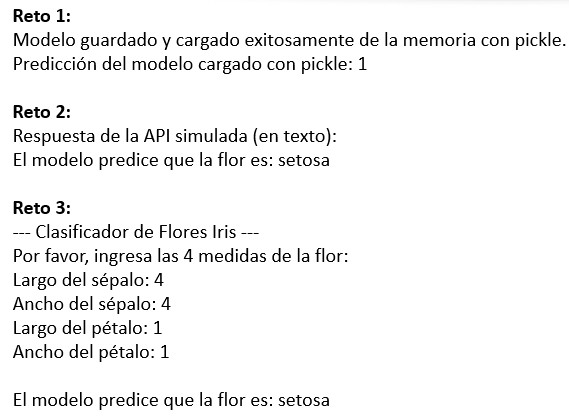

# Práctica 5. Despliegue y mantenimiento de modelos

Te damos la bienvenida a la práctica donde aprenderás los fundamentos para llevar un modelo de *Machine Learning* desde el entrenamiento a la producción.

## Objetivos
Al finalizar la práctica, serás capaz de:
  * **Persistir modelos** en memoria para su uso inmediato con `Joblib` y `Pickle`.
  * Comprender la **lógica de una API** para un modelo sin necesidad de un servidor externo.
  * Explorar cómo crear una **interfaz de usuario** simple para un modelo.

**Duración aproximada**
- 60 minutos.

## Instrucciones
Para la ejecución del código, ingresa a https://colab.research.google.com/

### Tarea 1. Persistencia de modelos en memoria

La **persistencia** te permite guardar un modelo entrenado para usarlo después, sin tener que volver a entrenarlo. En este ejercicio, simularás el proceso guardando el modelo en un búfer de memoria (`BytesIO`) en lugar de en un archivo físico.

**Paso 1.** Entrena un modelo y luego guárdalo y cárgalo de un búfer de memoria usando `Joblib`.

```python
import pandas as pd
import joblib
import io
from sklearn.linear_model import LogisticRegression
from sklearn.datasets import load_iris
from sklearn.model_selection import train_test_split

# 1. Entrenar el modelo
iris = load_iris()
X, y = iris.data, iris.target
X_train, X_test, y_train, y_test = train_test_split(X, y, test_size=0.2, random_state=42)

modelo = LogisticRegression(max_iter=200)
modelo.fit(X_train, y_train)

# 2. Guardar el modelo en un búfer de memoria
buffer_modelo = io.BytesIO()
joblib.dump(modelo, buffer_modelo)

# 3. Cargar el modelo desde el búfer
buffer_modelo.seek(0) # Mover el cursor al inicio del búfer
modelo_cargado = joblib.load(buffer_modelo)
print("Modelo guardado y cargado exitosamente de la memoria.")

# 4. Usar el modelo cargado para hacer una predicción
prediccion = modelo_cargado.predict(X_test[0:1])
print(f"Predicción del modelo cargado para el primer ejemplo de prueba: {prediccion[0]}")
print(f"Valor real: {y_test[0]}")
```

**Paso 2.** Utiliza la librería `pickle` para guardar y cargar el modelo del ejercicio a un búfer de memoria.

```python
# Pista de código para el reto:
import pickle
# Pista: usa el mismo flujo de trabajo: dump -> seek -> load

# Tu código aquí
```

-----

### Tarea 2. Lógica de una API para un modelo

Una **Interfaz de Programación de Aplicaciones (API)** permite que los programas se comuniquen. La lógica de una API que usa un modelo de Machine Learning es simple: recibe datos, los procesa, hace una predicción y devuelve un resultado. Puedes simular esta lógica sin un servidor real.

**Paso 1.** Simula un *endpoint* de una API que recibe datos en formato `JSON` y usa el modelo para hacer una predicción.

```python
import numpy as np
import joblib
import io
from sklearn.linear_model import LogisticRegression
from sklearn.datasets import load_iris
from sklearn.model_selection import train_test_split

# --- Código del Ejercicio 1 para hacer el modelo disponible ---
iris = load_iris()
X, y = iris.data, iris.target
X_train, X_test, y_train, y_test = train_test_split(X, y, test_size=0.2, random_state=42)
modelo = LogisticRegression(max_iter=200)
modelo.fit(X_train, y_train)

# Guardar el modelo en un búfer de memoria para simular la persistencia
buffer_modelo_api = io.BytesIO()
joblib.dump(modelo, buffer_modelo_api)
buffer_modelo_api.seek(0)
# --- Fin del código de persistencia ---

# Ahora, cargar el modelo desde el búfer para la lógica de la API
modelo_api = joblib.load(buffer_modelo_api)

# Simular una solicitud de datos en formato JSON
# Este JSON contiene las 4 características de la flor
datos_simulados = {
    "features": [5.1, 3.5, 1.4, 0.2]
}

# Lógica del endpoint de la API
def predecir_desde_json(datos_json):
    # Convertir la lista de features a un array de numpy
    datos_np = np.array(datos_json['features']).reshape(1, -1)

    # Hacer la predicción
    prediccion = modelo_api.predict(datos_np)

    # Devolver el resultado como un diccionario (simulando JSON)
    return {"prediction": int(prediccion[0])}

# Probar la función de la API
respuesta = predecir_desde_json(datos_simulados)
print("Respuesta de la API simulada:")
print(respuesta)
```

**Paso 2.** Modifica la función `predecir_desde_json` para que, en lugar de un diccionario, devuelva un mensaje de texto.

```python
# Pista de código para el reto:
# Pista: convierte la predicción numérica a una etiqueta de texto (ej. "setosa").

# Tu código aquí
```

-----

### Tarea 3. Interfaz de usuario simple

Las interfaces de usuario interactivas permiten que las personas interactúen con un modelo de forma sencilla. Puedes simular la lógica de una interfaz simple usando entradas y salidas de texto en el notebook.

**Paso 1.** Simula una interfaz de usuario que le pida datos al usuario, los use para predecir con el modelo y muestre el resultado.

```python
import numpy as np
import joblib
import io
from sklearn.linear_model import LogisticRegression
from sklearn.datasets import load_iris
from sklearn.model_selection import train_test_split

# --- Código para hacer el modelo disponible ---
iris = load_iris()
X, y = iris.data, iris.target
X_train, X_test, y_train, y_test = train_test_split(X, y, test_size=0.2, random_state=42)
modelo = LogisticRegression(max_iter=200)
modelo.fit(X_train, y_train)

# Guardar el modelo en un búfer de memoria para simular la persistencia
buffer_modelo_ui = io.BytesIO()
joblib.dump(modelo, buffer_modelo_ui)
buffer_modelo_ui.seek(0)
# --- Fin del código de persistencia ---

# Ahora, cargar el modelo desde el búfer para la lógica de la UI
modelo_ui = joblib.load(buffer_modelo_ui)

# Simular la interacción con el usuario (ej. como en Streamlit)
print("--- Clasificador de Flores Iris ---")
print("Por favor, ingresa las 4 medidas de la flor:")
sepal_length = float(input("Largo del sépalo: "))
sepal_width = float(input("Ancho del sépalo: "))
petal_length = float(input("Largo del pétalo: "))
petal_width = float(input("Ancho del pétalo: "))

# Preparar los datos y hacer la predicción
datos_input = np.array([[sepal_length, sepal_width, petal_length, petal_width]])
prediccion_ui = modelo_ui.predict(datos_input)

# Mapear la predicción numérica a una etiqueta de texto
etiquetas = load_iris().target_names
resultado_ui = etiquetas[prediccion_ui[0]]

print(f"\nEl modelo predice que la flor es: {resultado_ui}")
```

**Paso 2.** Agrega una validación al código para que, si el usuario ingresa un valor negativo, se le muestre un mensaje de error en lugar de hacer la predicción.

```python
# Pista de código para el reto:
# Pista: usa una sentencia `if` o un bloque `try-except` para verificar la entrada.

# Tu código aquí
```
### Resultado esperado

