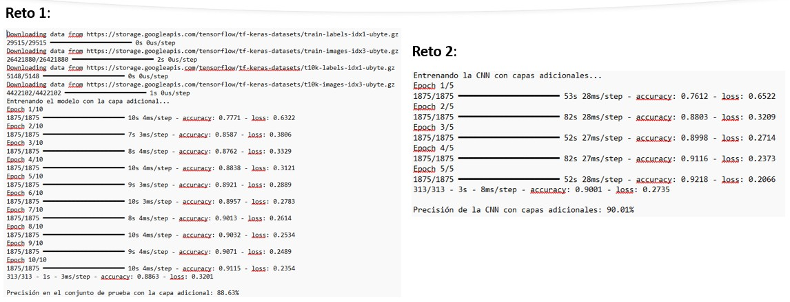

# Práctica 7. Construcción y aplicaciones de redes neuronales

## Objetivos
Al finalizar la práctica, serás capaz de:

  * Comprender el **diseño y la configuración** de arquitecturas de redes neuronales.
  * Conocer metodologías de **entrenamiento y validación** para un rendimiento óptimo.
  * Entender los **fundamentos y la aplicación** de las **redes neuronales convolucionales (CNN)** en la visión por computadora.
  * Explorar cómo las operaciones de **convolución** extraen características de las imágenes.

## Duración aproximada
- 60 minutos.

## Instrucciones
Para la ejecución del código, ingresa a https://colab.research.google.com/

### Tarea 1. Configuración y entrenamiento de redes neuronales

En esta sección, te centrarás en los aspectos prácticos de la construcción de modelos, utilizando el conjunto de datos de la moda de **Fashion-MNIST**. Este *dataset* es ideal para la clasificación de imágenes a pequeña escala y consta de 10 categorías de prendas de vestir. 
En este ejercicio, construirás una red neuronal densa, donde cada neurona está conectada a todas las neuronas de la capa anterior.

Para usar las imágenes de Fashion-MNIST en una red densa, primero se **aplanan** la cuadrícula de píxeles (28x28) en un solo vector de 784 píxeles. Esto permite que el modelo procese la imagen como una secuencia de números. Las capas subsiguientes (`Dense`) aprenden a reconocer patrones en estos datos aplanados para clasificar la prenda.

**Paso 1.** Diseña y entrena una red neuronal con múltiples capas para clasificar las diez categorías de imágenes en el conjunto de datos de Fashion-MNIST.

```python
import tensorflow as tf
from tensorflow import keras
import numpy as np

# Cargar el conjunto de datos
(X_train, y_train), (X_test, y_test) = keras.datasets.fashion_mnist.load_data()

# Preprocesamiento de datos
X_train = X_train / 255.0
X_test = X_test / 255.0

# 1. Diseñar el modelo
modelo_fashion = keras.Sequential([
    keras.Input(shape=(28, 28)), # Capa de entrada recomendada para evitar la advertencia
    keras.layers.Flatten(),
    keras.layers.Dense(128, activation='relu'),
    keras.layers.Dense(10, activation='softmax') # Capa de salida para 10 clases
])

# 2. Compilar el modelo
modelo_fashion.compile(optimizer='adam',
                       loss='sparse_categorical_crossentropy',
                       metrics=['accuracy'])

# 3. Entrenar el modelo
print("Entrenando el modelo...")
modelo_fashion.fit(X_train, y_train, epochs=10, verbose=1)

# 4. Evaluar la precisión
test_loss, test_acc = modelo_fashion.evaluate(X_test, y_test, verbose=2)
print(f"\nPrecisión en el conjunto de prueba: {test_acc*100:.2f}%")
```

**Paso 2.** Experimenta con la arquitectura de la red. Agrega una capa oculta adicional con `Dense(64, activation='relu')` y entrena el modelo de nuevo. ¿Mejora o empeora el rendimiento?

```python
# Pista de código para el reto:
# Para agregar la nueva capa, necesitas insertar una línea de código en la lista de capas dentro de keras.Sequential.
# Piensa dónde sería más lógico colocar la nueva capa de 64 neuronas para que la información fluya correctamente a través del modelo.
# Por lo general, las capas se colocan de mayor a menor tamaño para permitir un aprendizaje progresivo de las características.

# Pista: completa la lista de capas.
modelo_fashion_reto = keras.Sequential([
    keras.Input(shape=(28, 28)),
    keras.layers.Flatten(),
    keras.layers.Dense(128, activation='relu'),
    # Inserta aquí la nueva capa Dense con 64 neuronas y función de activación 'relu'
    # ...
    keras.layers.Dense(10, activation='softmax')
])

# No olvides compilar y entrenar el nuevo modelo después de definirlo.
```

-----

### Tarea 2. Fundamentos de redes convolucionales (CNN)

Las CNN son un tipo de red neuronal especializado para procesar datos con una topología conocida, como las imágenes. A diferencia de las redes densas, que aplanan la imagen, las CNN trabajan directamente con la cuadrícula de píxeles, utilizando operaciones de **convolución** para escanear la imagen y detectar patrones como bordes, texturas y formas. Una **capa de pooling** se usa para reducir la dimensionalidad y hacer el modelo más eficiente. Juntas, estas operaciones crean una representación jerárquica de la imagen que es muy efectiva.

En este ejercicio, construirás una CNN simple para ver cómo este enfoque mejora la precisión en la clasificación de imágenes en comparación con la red densa del ejercicio anterior.

**Paso 1.** Construye una CNN simple y aplícala al mismo conjunto de datos de Fashion-MNIST.

```python
import tensorflow as tf
from tensorflow import keras
import numpy as np

# Cargar y preprocesar los datos
(X_train, y_train), (X_test, y_test) = keras.datasets.fashion_mnist.load_data()

# Redimensionar las imágenes para la capa de convolución
# (número_muestras, altura, anchura, canales)
# El canal es 1 porque las imágenes son en escala de grises
X_train_cnn = X_train[..., np.newaxis] / 255.0
X_test_cnn = X_test[..., np.newaxis] / 255.0

# 1. Diseñar la CNN
modelo_cnn = keras.Sequential([
    keras.Input(shape=(28, 28, 1)), # Capa de entrada recomendada para evitar la advertencia
    keras.layers.Conv2D(32, (3, 3), activation='relu'),
    keras.layers.MaxPooling2D((2, 2)), # Capa de pooling para reducir la dimensionalidad
    keras.layers.Flatten(),
    keras.layers.Dense(64, activation='relu'),
    keras.layers.Dense(10, activation='softmax')
])

# 2. Compilar y entrenar el modelo
modelo_cnn.compile(optimizer='adam',
                   loss='sparse_categorical_crossentropy',
                   metrics=['accuracy'])

print("Entrenando la CNN...")
modelo_cnn.fit(X_train_cnn, y_train, epochs=5, verbose=1)

# 3. Evaluar la precisión
test_loss_cnn, test_acc_cnn = modelo_cnn.evaluate(X_test_cnn, y_test, verbose=2)
print(f"\nPrecisión de la CNN en el conjunto de prueba: {test_acc_cnn*100:.2f}%")
```

**Paso 2.** Modifica el modelo para que incluya una segunda capa de **convolución** y otra de *pooling*. ¿Cómo afecta esto al rendimiento y al tiempo de entrenamiento?

```python
# Pista de código para el reto:
# Para este reto, tu objetivo es hacer que el modelo sea más profundo para ver si puede aprender características más complejas.
# Esto se logra apilando capas de convolución y pooling antes de la capa Flatten.
# Recuerda que cada capa de convolución crea más feature maps o mapas de características
# (a menudo se duplica el número de filtros) para que el modelo pueda aprender de forma más granular.

# Pista: completa la secuencia de capas.
modelo_cnn_reto = keras.Sequential([
    keras.Input(shape=(28, 28, 1)),
    keras.layers.Conv2D(32, (3, 3), activation='relu'),
    keras.layers.MaxPooling2D((2, 2)),
    # Agrega aquí tu segunda capa Conv2D (puedes usar 64 filtros)
    # Agrega aquí tu segunda capa MaxPooling2D
    # ...
    keras.layers.Flatten(),
    keras.layers.Dense(64, activation='relu'),
    keras.layers.Dense(10, activation='softmax')
])

# No olvides compilar y entrenar el nuevo modelo y comparar sus resultados con el modelo anterior.
```
### Resultado esperado

